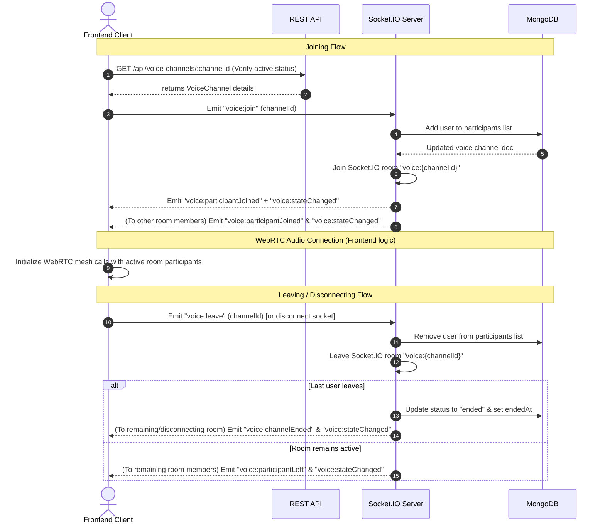

# Voice Channel Frontend Integration Guide

This document describes the current backend voice channel contract for the Majlis frontend.

## Overview

The voice channel feature allows users to create and participate in real-time voice rooms. It is built on top of:

- **REST APIs** for creating, listing, retrieving, and ending voice channels.
- **Socket.IO** for real-time room presence management, joining/leaving tracking, and state synchronization.
- **MongoDB** for persistent voice channel and participant records.

> [!NOTE]
> **Important Audio & WebRTC Note:**
> The backend coordinates room memberships, presence (who is in the room), and channel statuses (active/ended). It does **not** perform WebRTC signaling (SDP offer/answer, ICE candidates) or process media streams. The frontend must implement media streaming (e.g., via a peer-to-peer WebRTC mesh, a third-party service like LiveKit/Agora, or a separate WebRTC signaling flow) triggered by the socket presence events documented below.

---

## Authentication

### HTTP

All voice channel routes require authentication via a JWT token. Send the token in the `Authorization` header:

```text
Authorization: Bearer <your_jwt_token>
```

### Socket.IO

When establishing a Socket.IO connection, the client must send the token in the handshake authentication payload:

```ts
import { io } from "socket.io-client";

const socket = io(SERVER_URL, {
  auth: {
    token: accessToken,
  },
});
```

If the token is missing, invalid, or the user's account is not active, the server will reject the connection with an authentication error code (`MISSING_TOKEN` or `INVALID_TOKEN`).

---

## Base Route

All voice channel HTTP routes are mounted at:

```text
/api/voice-channels
```

---

## REST APIs

All API responses use the JSend format wrapper.

### 1. List Active Voice Channels

Retrieve a list of all active voice channels, optionally filtered by category.

```http
GET /api/voice-channels?categoryId=60d5ec49f1b29e3d8c1a2c34
```

#### Query Parameters
- `categoryId` (optional, string): Valid 24-character hex MongoDB ObjectId. If provided, filters channels by that category.

#### Response (Success)
```json
{
  "status": "success",
  "data": {
    "data": [
      {
        "_id": "6483f2a5b6d912001c234567",
        "title": "React Native Discussion",
        "category": {
          "_id": "60d5ec49f1b29e3d8c1a2c34",
          "name": "Development",
          "slug": "development"
        },
        "createdBy": {
          "_id": "60d5ec49f1b29e3d8c1a2c11",
          "username": "belal",
          "avatar": "https://res.cloudinary.com/.../avatar.jpg"
        },
        "participants": [
          {
            "_id": "6483f2e1b6d912001c234569",
            "user": {
              "_id": "60d5ec49f1b29e3d8c1a2c11",
              "username": "belal",
              "avatar": "https://res.cloudinary.com/.../avatar.jpg"
            },
            "joinedAt": "2026-06-09T08:12:00.000Z",
            "isMuted": false,
            "isDeafened": false
          }
        ],
        "status": "active",
        "endedAt": null,
        "createdAt": "2026-06-09T08:12:00.000Z",
        "updatedAt": "2026-06-09T08:12:00.000Z",
        "participantCount": 1
      }
    ],
    "message": "Voice channels retrieved successfully"
  }
}
```

---

### 2. Create a Voice Channel

Create a new voice channel. The creator is automatically added as the first participant.

```http
POST /api/voice-channels
Content-Type: application/json
```

#### Request Body
- `title` (required, string): Channel name, between 2 and 80 characters (whitespace is trimmed).
- `categoryId` (required, string): Valid 24-character hex MongoDB ObjectId.

```json
{
  "title": "Tech Talk - WebRTC Architecture",
  "categoryId": "60d5ec49f1b29e3d8c1a2c34"
}
```

#### Response (Success - 201 Created)
```json
{
  "status": "success",
  "data": {
    "data": {
      "_id": "6483f2a5b6d912001c234567",
      "title": "Tech Talk - WebRTC Architecture",
      "category": {
        "_id": "60d5ec49f1b29e3d8c1a2c34",
        "name": "Development",
        "slug": "development"
      },
      "createdBy": {
        "_id": "60d5ec49f1b29e3d8c1a2c11",
        "username": "belal",
        "avatar": "https://res.cloudinary.com/.../avatar.jpg"
      },
      "participants": [
        {
          "_id": "6483f2a5b6d912001c234568",
          "user": {
            "_id": "60d5ec49f1b29e3d8c1a2c11",
            "username": "belal",
            "avatar": "https://res.cloudinary.com/.../avatar.jpg"
          },
          "joinedAt": "2026-06-09T08:15:00.000Z",
          "isMuted": false,
          "isDeafened": false
        }
      ],
      "status": "active",
      "endedAt": null,
      "createdAt": "2026-06-09T08:15:00.000Z",
      "updatedAt": "2026-06-09T08:15:00.000Z",
      "participantCount": 1
    },
    "message": "Voice channel created successfully"
  }
}
```

---

### 3. Get Voice Channel Details

Retrieve complete details for a specific voice channel.

```http
GET /api/voice-channels/:channelId
```

#### Path Parameters
- `channelId` (required, string): Valid 24-character hex MongoDB ObjectId of the voice channel.

#### Response (Success - 200 OK)
```json
{
  "status": "success",
  "data": {
    "data": {
      "_id": "6483f2a5b6d912001c234567",
      "title": "Tech Talk - WebRTC Architecture",
      "category": {
        "_id": "60d5ec49f1b29e3d8c1a2c34",
        "name": "Development",
        "slug": "development"
      },
      "createdBy": {
        "_id": "60d5ec49f1b29e3d8c1a2c11",
        "username": "belal",
        "avatar": "https://res.cloudinary.com/.../avatar.jpg"
      },
      "participants": [
        {
          "_id": "6483f2a5b6d912001c234568",
          "user": {
            "_id": "60d5ec49f1b29e3d8c1a2c11",
            "username": "belal",
            "avatar": "https://res.cloudinary.com/.../avatar.jpg"
          },
          "joinedAt": "2026-06-09T08:15:00.000Z",
          "isMuted": false,
          "isDeafened": false
        }
      ],
      "status": "active",
      "endedAt": null,
      "createdAt": "2026-06-09T08:15:00.000Z",
      "updatedAt": "2026-06-09T08:15:00.000Z",
      "participantCount": 1
    },
    "message": "Voice channel retrieved successfully"
  }
}
```

---

### 4. End a Voice Channel

Instantly close the voice channel. This operation is restricted to the **owner/creator** of the channel or an **admin**.

```http
PATCH /api/voice-channels/:channelId/end
```

#### Path Parameters
- `channelId` (required, string): Valid 24-character hex MongoDB ObjectId of the voice channel.

#### Response (Success - 200 OK)
```json
{
  "status": "success",
  "data": {
    "data": {
      "_id": "6483f2a5b6d912001c234567",
      "title": "Tech Talk - WebRTC Architecture",
      "category": {
        "_id": "60d5ec49f1b29e3d8c1a2c34",
        "name": "Development",
        "slug": "development"
      },
      "createdBy": {
        "_id": "60d5ec49f1b29e3d8c1a2c11",
        "username": "belal",
        "avatar": "https://res.cloudinary.com/.../avatar.jpg"
      },
      "participants": [],
      "status": "ended",
      "endedAt": "2026-06-09T08:30:00.000Z",
      "createdAt": "2026-06-09T08:15:00.000Z",
      "updatedAt": "2026-06-09T08:30:00.000Z",
      "participantCount": 0
    },
    "message": "Voice channel ended successfully"
  }
}
```

---

## Data Models & Payloads

### VoiceChannel Payload (`VoiceChannelPayload`)

This structure represents the current state of a channel returned by REST endpoints and socket state change events.

```ts
interface VoiceChannelPayload {
  _id: string;                      // Voice channel ID
  title: string;                    // Title of the channel
  category: {                       // Populated Category object
    _id: string;
    name: string;
    slug: string;
  };
  createdBy: {                      // Populated creator User details
    _id: string;
    username: string;
    avatar?: string;
  };
  participants: VoiceChannelParticipantPayload[]; // List of current active participants
  status: "active" | "ended";
  endedAt: Date | null;             // Timestamp when the channel ended, or null
  createdAt: Date;
  updatedAt: Date;
  participantCount: number;         // Pre-calculated length of the participants list
}
```

### Participant Payload (`VoiceChannelParticipantPayload`)

Represents a single user joined to the voice channel.

```ts
interface VoiceChannelParticipantPayload {
  _id: string;                      // Participant entry ID in DB
  user: {                           // Populated user details
    _id: string;
    username: string;
    avatar?: string;
  };
  joinedAt: Date;                   // Timestamp when this user joined
  isMuted: boolean;                 // User mic mute status (default: false)
  isDeafened: boolean;              // User audio deafen status (default: false)
}
```

---

## Socket.IO Events

All Socket.IO events for voice channels are prefixed with `voice:`.

### Client-to-Server Events (Emitted by Frontend)

#### 1. Join a Voice Channel Room

Requests to join a voice room. The server automatically adds the user to the database participant list if not already there, subscribes the socket connection to the room `voice:${channelId}`, and alerts other members.

```ts
socket.emit("voice:join", channelId);
```

- **Arguments:**
  - `channelId` (string): The ObjectId of the voice channel.

#### 2. Leave a Voice Channel Room

Requests to leave the voice room. The server removes the user from the database participant list, unsubscribes the socket connection from the room `voice:${channelId}`, and alerts other members.

```ts
socket.emit("voice:leave", channelId);
```

- **Arguments:**
  - `channelId` (string): The ObjectId of the voice channel.

> [!NOTE]
> If a leaving participant was the **last user** in the channel, the server will automatically transition the channel status to `"ended"`, setting `endedAt` to the current time.

#### 3. Force End a Voice Channel

Requests to end the channel. Only authorized for the channel creator or an admin. It ends the channel in the DB and informs all connected users.

```ts
socket.emit("voice:end", channelId);
```

- **Arguments:**
  - `channelId` (string): The ObjectId of the voice channel.

---

### Server-to-Client Events (Listened to by Frontend)

#### 1. State Changed (`voice:stateChanged`)

Emitted to all sockets in the channel room whenever the voice channel model is modified (e.g., someone joins, leaves, mutes, or the channel is ended).

```ts
socket.on("voice:stateChanged", (channel: VoiceChannelPayload) => {
  // Update UI with the new channel state, list of participants, etc.
});
```

#### 2. Participant Joined (`voice:participantJoined`)

Emitted to all sockets in the room when a new user joins the channel. Useful for toast notifications or playing join sounds.

```ts
socket.on("voice:participantJoined", (payload) => {
  console.log(`User ${payload.participant.username} joined.`);
});
```

##### Payload Shape:
```ts
{
  channelId: string;
  participant: {
    _id: string;       // User ID
    username: string;
    avatar?: string;
  };
  participantCount: number;
}
```

#### 3. Participant Left (`voice:participantLeft`)

Emitted to all sockets in the room when a user leaves the channel (or gets disconnected).

```ts
socket.on("voice:participantLeft", (payload) => {
  console.log(`User ${payload.participantId} left.`);
});
```

##### Payload Shape:
```ts
{
  channelId: string;
  participantId: string; // User ID
  participantCount: number;
}
```

#### 4. Channel Ended (`voice:channelEnded`)

Emitted to all sockets in the room when the channel is ended (either explicitly by `voice:end`, by PATCH HTTP request, or automatically when the last participant leaves).

```ts
socket.on("voice:channelEnded", (channel: VoiceChannelPayload) => {
  // Route user back to list, stop local WebRTC/audio streams, clean up state.
});
```

---

## Connection & Disconnection Cleanups

The backend incorporates automatic cleanup for Socket disconnects:

- If a client disconnects unexpectedly (e.g., network failure, tab close), the server handles the `disconnecting` lifecycle hook.
- It scans all room memberships prefixed with `voice:`.
- For each active voice room, it performs the standard **leave** operations:
  1. Removes the user from the channel's `participants` list in the DB.
  2. Emits `voice:participantLeft` to the room.
  3. Emits `voice:stateChanged` with the updated channel state to the room.
  4. If this user was the last participant, it transitions the channel status to `"ended"` and emits `voice:channelEnded` to the room.

Therefore, the frontend does not need to send an explicit `voice:leave` event during page unmounts or before tab closings; the backend will automatically clean up the state on socket disconnect.

---

## Recommended Integration Flow

Here is the standard flow when a user joins a voice channel on the frontend:



### Best Practices for Frontend Developers:

1. **Active State Synchronization:**
   Use the `voice:stateChanged` payload as the single source of truth for who is currently inside the voice channel. When a state change event arrives, refresh the local participants grid.
2. **Handle Socket Disconnects Gracioiusly:**
   If your Socket.IO connection is interrupted (e.g., server restart or temporary internet drop), do not immediately assume the voice channel is ended, but be prepared to automatically re-emit `"voice:join"` once the socket reconnects to ensure the backend puts you back into the participant registry.
3. **WebRTC Integration Timing:**
   Initialize your WebRTC peer connections only *after* receiving a successful `voice:stateChanged` or `voice:participantJoined` notification, knowing exactly who is in the room. When another user joins, establish a new peer connection (peer-to-peer) with that user. When `voice:participantLeft` is received for a user, close their corresponding peer connection.
